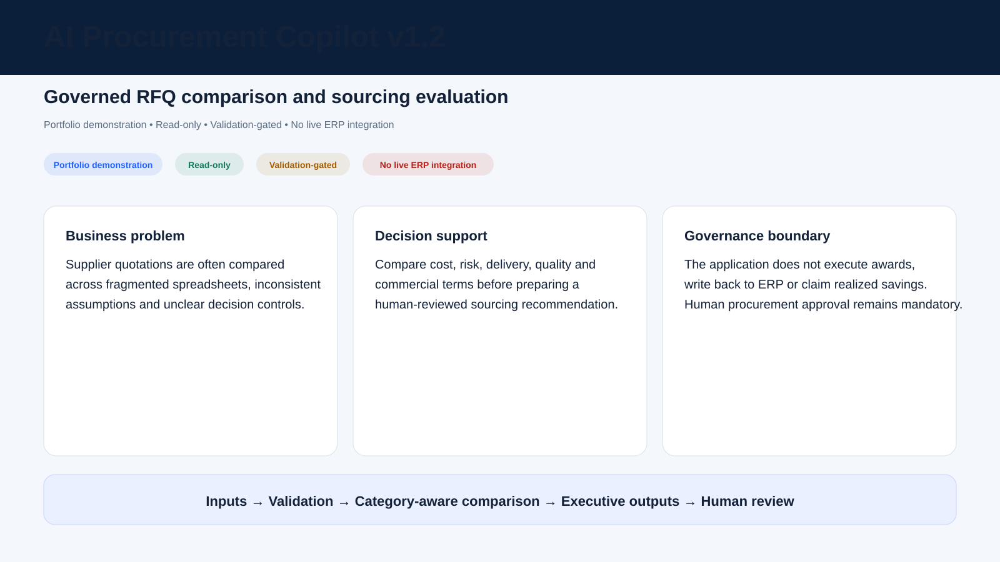
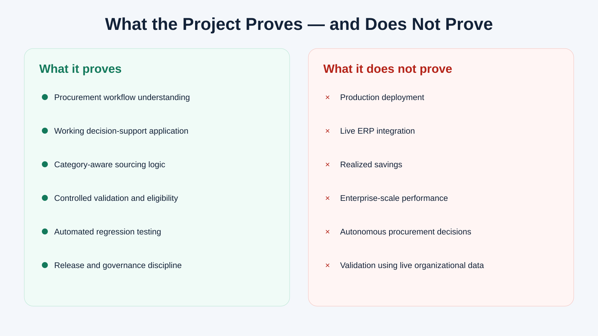
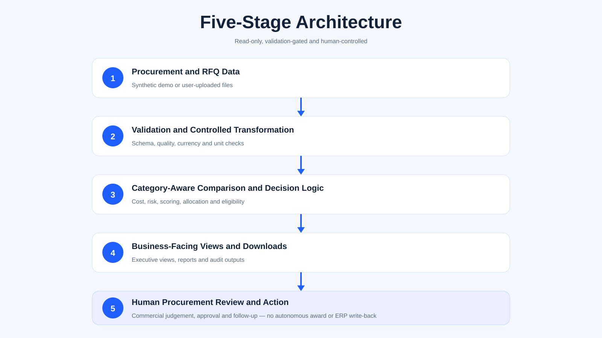

# AI Procurement Copilot v1.2

**Governed, category-aware procurement decision support for RFQ comparison and sourcing evaluation.**

> Portfolio demonstration · Read-only · Validation-gated · No live ERP integration



**Hosted application:** `https://ai-procurement-copilot-v1-2.streamlit.app/`

**Repository:** `pratikoperations/AI-Procurement-Copilot`

## Project status

- Release: **AI Procurement Copilot v1.2 — Portfolio Presentation Release**
- Current state: **completed, merged to `main` and frozen**
- Authoritative frozen `main` SHA: **`4803b1d72fa8a6509d9d7faf0e9decc677c447be`**
- Frozen v1.1 baseline: **`b85cd37aaae709058eb15350d680b18c03da46ba`**
- Scope: presentation, documentation, responsive navigation, tests and release governance
- Product logic: unchanged from the frozen v1.1 baseline
- Tag: **not created by deliberate release decision**
- GitHub Release: **not created by deliberate release decision**
- Further v1.2 modification: **not authorized**

## Business problem

Procurement teams often compare supplier quotations across disconnected spreadsheets, inconsistent assumptions and incomplete evidence. A lowest-price result can be mistaken for a best-value decision, while risk, delivery, quality, commercial terms and data confidence remain difficult to explain.

AI Procurement Copilot turns that fragmented review into a visible, governed decision-support workflow. It helps procurement professionals compare quotations, test sourcing scenarios, prepare negotiation positions and generate consistent review outputs without replacing human approval.

## Five business questions answered

1. Are supplier quotations sufficiently complete and valid for comparison?
2. How do quotations compare after governed currency, unit and comparison-basis handling?
3. Which commercial, cost, risk and sourcing factors materially affect the recommendation?
4. When should the system withhold award-oriented language because evidence is insufficient?
5. Which executive and downloadable outputs can support human procurement review?

## How the workflow works

1. Select a category, commodity and commercial assumptions.
2. Load synthetic data or an RFQ workbook/CSV.
3. Validate structure, completeness, currency, units and business rules.
4. Compare supplier cost, risk, performance, ESG and commercial conditions.
5. Review scenarios, allocation options and negotiation intelligence.
6. Generate executive-facing and machine-readable outputs.
7. Complete human procurement review and approval outside the application.

See [User Workflow](docs/03_USER_WORKFLOW.md).

## Key capabilities

- Packaging and raw-material procurement workflows
- Supplier quotation validation and governed comparison
- Original and normalized quotation data preservation
- USD, INR and dual-display handling
- Category-specific should-cost, TCO, risk and scoring
- Procurement Intelligence and Supplier Intelligence views
- Supplier 360, performance, financial, ESG, innovation and SRM analysis
- Scenario testing, allocation and negotiation support
- Validation-gated recommendation language
- Executive memos, supplier communication and governed downloads
- Read-only ERP workbook structural preview with draft mappings

## What this project proves

- Practical understanding of procurement and sourcing workflows
- Ability to translate procurement requirements into a working application
- Category-aware comparison and decision-support logic
- Controlled validation and human-review gates
- Automated testing and release discipline
- Clear separation between business-facing reports and audit outputs
- Governed ERP-export intake without overstating integration maturity

## What it does not prove

- Production deployment readiness
- Live SAP or Oracle integration
- Universal ERP mappings
- Automated supplier or item matching
- Enterprise-scale performance
- Realized savings from live organizational use
- Autonomous sourcing, supplier approval or award execution
- ERP write-back



## Architecture



The ERP Upload Preview remains isolated from procurement engines and performs structural, package-safety and draft-mapping checks only.

See [Architecture](docs/04_ARCHITECTURE.md) and [Data and Validation](docs/05_DATA_AND_VALIDATION.md).

## Public visual package

The four application-view assets use synthetic, generic content and are illustrative representations of the implemented workflow. They are not substitutes for direct hosted-device verification. Final hosted desktop, tablet and mobile verification was completed and approved during v1.2 release closure.

- [Executive landing view](docs/assets/screens/01_executive_landing.svg)
- [RFQ and sourcing comparison](docs/assets/screens/02_sourcing_comparison.svg)
- [Validation and decision control](docs/assets/screens/03_validation_control.svg)
- [Executive outputs and governed downloads](docs/assets/screens/04_executive_outputs.svg)
- [Visual Design System](docs/VISUAL_DESIGN_SYSTEM.md)
- [LinkedIn Asset Package](docs/LINKEDIN_ASSET_PACKAGE.md)

## Test and quality evidence

The repository uses automated checks for compilation, procurement calculations, validation, currency and unit integrity, exports, UI contracts, ERP preview controls and Streamlit startup.

Final v1.2 evidence:

- reviewed implementation head: `6838effb6f47b327419d7801c01c6284514f0cbb`;
- Quality Checks run #492, run ID `30434354425`: **success**;
- 226 regression tests passed with 0 failures, 0 errors and 0 skips;
- canonical Streamlit smoke test passed;
- final documentation-only release-record head `e61a26eef65ffd7e6bd015ae2168e26a5c42747f`;
- Quality Checks run #493, run ID `30440102419`: **success**;
- final merge commit and frozen `main`: `4803b1d72fa8a6509d9d7faf0e9decc677c447be`.

See [Test Evidence](docs/06_TEST_EVIDENCE.md) and [Release Record](docs/09_RELEASE_RECORD.md).

## Governance and limitations

- Human procurement approval remains mandatory.
- Failed validation can block or condition recommendation language.
- The application does not execute transactions or mutate ERP systems.
- Illustrative monetary outputs are not realized savings claims.
- Synthetic or sanitized data should be used for public demonstration.
- Production use would require identity, access, security, privacy, logging and operational controls outside this portfolio scope.
- The hosted application is portfolio evidence, not a live organizational deployment.

See [Governance and Limitations](docs/07_GOVERNANCE_AND_LIMITATIONS.md).

## Documentation by audience

- [Executive Overview](docs/01_EXECUTIVE_OVERVIEW.md) — recruiter-level summary
- [Business Case Study](docs/02_BUSINESS_CASE_STUDY.md) — hiring-manager narrative
- [User Workflow](docs/03_USER_WORKFLOW.md) — sourcing journey
- [Architecture](docs/04_ARCHITECTURE.md) — technical structure
- [Data and Validation](docs/05_DATA_AND_VALIDATION.md) — controls and evidence
- [Test Evidence](docs/06_TEST_EVIDENCE.md) — quality gates
- [Governance and Limitations](docs/07_GOVERNANCE_AND_LIMITATIONS.md) — claim boundaries
- [Demo Guide](docs/08_DEMO_GUIDE.md) — private presentation sequence
- [Release Record](docs/09_RELEASE_RECORD.md) — v1.2 governance record

## Technical setup

```bash
pip install -r requirements.txt
streamlit run app.py
```

Run tests:

```bash
python -m pytest
```

Detailed setup and portability guidance remain in `SETUP_GUIDE.md`, `AI_HANDOFF_GUIDE.md` and `PROJECT_ARCHITECTURE.md`.

## Version history

| Version | Position |
|---|---|
| v1.0.0 | First stable Portfolio Edition baseline |
| v1.0.1 | Governed maintenance release |
| v1.1 | Completed ERP structural foundation and read-only ERP Upload Preview; frozen at `b85cd37aaae709058eb15350d680b18c03da46ba` |
| v1.2 | Completed Portfolio Presentation Release; merged through PR #14 and frozen at `4803b1d72fa8a6509d9d7faf0e9decc677c447be` |

## Release relationship

v1.2 does not describe v1.1 as incomplete and does not rewrite its history. It adds recruiter-first documentation, public presentation improvements, responsive navigation, visual evidence and release governance on top of the completed frozen v1.1 baseline. No further v1.2 changes are authorized unless a separate controlled maintenance action is approved.